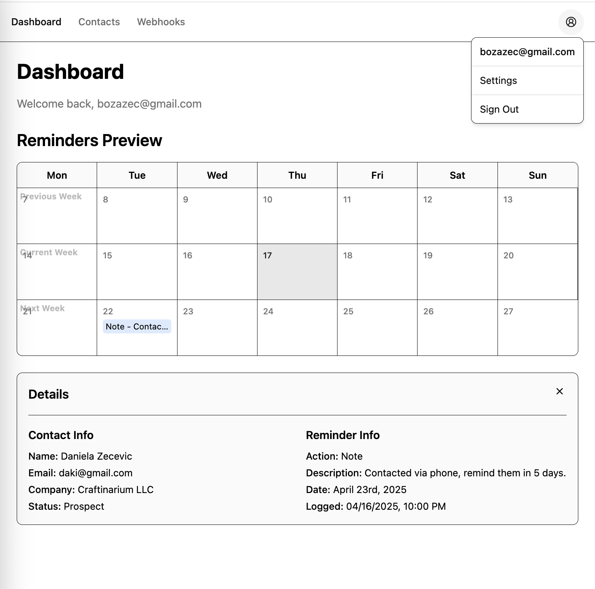

# Simple CRM with n8n Webhook Integration

This project is a lightweight Customer Relationship Management (CRM) application built with React, TypeScript, and Supabase. It allows users to manage contacts, log activities, and configure webhooks to trigger n8n workflows based on specific CRM events.

## Try the demo
Go to https://visionary-liger-23d2af.netlify.app/
1. create account
2. go to your email and confirm by click on the link
3. boom you are logged in
4. you can pump now (PUMPAJ)

// add image


## Features

*   **User Authentication:** Secure login and registration using Supabase Auth.
*   **Contact Management:** Create, view, edit, and delete contacts.
*   **Activity Logging:** Log activities (calls, emails, notes) associated with contacts. Set reminders for activities.
*   **Webhook Configuration:**
    *   Define webhooks to trigger external workflows (specifically designed for n8n).
    *   Supported events: `contact.created`, `contact.updated`, `activity.created`.
    *   Add, edit, and delete webhook configurations.
*   **Development Proxy:** Vite proxy configured for seamless local development with n8n webhook endpoints, avoiding CORS issues.

## Technologies Used

*   **Frontend:**
    *   [React](https://react.dev/) (v19) with [TypeScript](https://www.typescriptlang.org/)
    *   [Vite](https://vitejs.dev/) for development and bundling
    *   [React Router](https://reactrouter.com/) for routing
    *   [Tailwind CSS](https://tailwindcss.com/) for styling
    *   [Shadcn/ui](https://ui.shadcn.com/) for UI components (built on Radix UI)
    *   [React Hook Form](https://react-hook-form.com/) & [Zod](https://zod.dev/) for form handling and validation
    *   [React Toastify](https://fkhadra.github.io/react-toastify/) for notifications
    *   [date-fns](https://date-fns.org/) for date utilities
*   **Backend:**
    *   [Supabase](https://supabase.com/) for database, authentication, and real-time features (via Row Level Security).
*   **Automation:**
    *   [n8n](https://n8n.io/) (external self-hosted or cloud instance) for workflow automation triggered by webhooks.

## Project Structure

```
crm-app/
├── public/              # Static assets
├── src/
│   ├── components/      # Reusable UI components (layout, forms, UI elements)
│   │   ├── activity/
│   │   ├── contacts/
│   │   ├── layout/
│   │   ├── ui/          # Shadcn/ui components
│   │   └── webhooks/
│   ├── contexts/        # React contexts (e.g., AuthContext)
│   ├── hooks/           # Custom React hooks (if any)
│   ├── layouts/         # Page layout components (MainLayout, AuthLayout)
│   ├── lib/             # Utility functions, Supabase client, etc.
│   ├── pages/           # Page components mapped to routes
│   ├── types/           # TypeScript type definitions
│   ├── App.tsx          # Main application component with routing setup
│   └── main.tsx         # Application entry point
├── .env                 # Environment variables (Supabase keys) - **DO NOT COMMIT**
├── eslint.config.js     # ESLint configuration
├── index.html           # Main HTML entry point
├── package.json         # Project dependencies and scripts
├── postcss.config.js    # PostCSS configuration
├── tailwind.config.js   # Tailwind CSS configuration
├── tsconfig.json        # TypeScript configuration
├── vite.config.ts       # Vite configuration (including proxy)
└── README.md            # This file
```

## Getting Started

### Prerequisites

*   Node.js (v18 or later recommended)
*   npm or yarn
*   A Supabase account and project.
*   An n8n instance (Cloud or self-hosted) accessible via HTTPS.

### Setup

1.  **Clone the repository:**
    ```bash
    git clone <repository-url>
    cd crm-app
    ```

2.  **Install dependencies:**
    ```bash
    npm install
    # or
    yarn install
    ```

3.  **Set up Supabase:**
    *   Create a new project on [Supabase](https://supabase.com/).
    *   Navigate to **Project Settings** > **API**.
    *   Find your **Project URL** and **anon public** API key.
    *   Create a `.env` file in the `crm-app` root directory by copying `.env.example` (if it exists) or creating it manually.
    *   Add your Supabase credentials to the `.env` file:
        ```env
        VITE_SUPABASE_URL=YOUR_SUPABASE_PROJECT_URL
        VITE_SUPABASE_ANON_KEY=YOUR_SUPABASE_ANON_PUBLIC_KEY
        ```
    *   **Database Schema:** You'll need to set up the necessary tables in your Supabase database (`contacts`, `activity_logs`, `webhooks`). Define appropriate columns and relationships. Consider using the Supabase SQL editor or migrations.
    *   **Row Level Security (RLS):** It's **highly recommended** to enable RLS on your tables (`contacts`, `activity_logs`, `webhooks`) and create policies to ensure users can only access and modify their own data. Policies should typically check `auth.uid() = user_id`.

4.  **Configure n8n Proxy (Development):**
    *   Open `crm-app/vite.config.ts`.
    *   Locate the `server.proxy` configuration.
    *   Update the `target` URL to point to your actual n8n instance URL:
        ```typescript
        server: {
          proxy: {
            '/api/n8n': {
              target: 'https://YOUR_N8N_INSTANCE.app.n8n.cloud', // Or your self-hosted URL
              changeOrigin: true,
              rewrite: (path) => path.replace(/^\/api\/n8n/, ''),
            }
          }
        }
        ```

### Running the Development Server

```bash
npm run dev
# or
yarn dev
```

This will start the Vite development server, typically at `http://localhost:5173`. The application will open in your default browser.

### n8n Webhook Configuration Notes

*   When adding a webhook in the CRM UI, enter **only the path** of your n8n webhook URL (e.g., `/webhook/your-workflow-id`), not the full `https://...` URL.
*   The frontend application sends requests to `/api/n8n/your-webhook-path`.
*   The Vite development server proxies these requests to `https://YOUR_N8N_INSTANCE/.../your-webhook-path`.
*   For **production deployments**, you will need to configure similar proxying/rewriting rules on your hosting provider (e.g., Netlify, Vercel, Nginx) to forward requests from `/api/n8n/...` to your n8n instance.

## Building for Production

```bash
npm run build
# or
yarn build
```

This command bundles the application into the `dist/` directory, optimized for production deployment.

## Linting

```bash
npm run lint
# or
yarn lint
```

This command runs ESLint to check for code style and potential errors.
